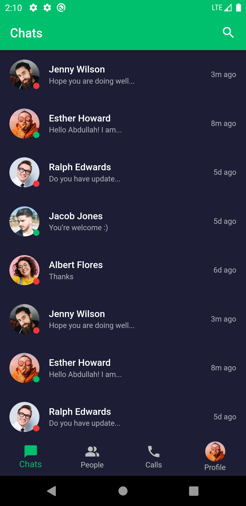

# VelocityChat

A Flutter UI Kit for Chat.

## Steps To Run the Project Locally

---> Get all the dependencies of the project by

```Shell
flutter pub get
```

---> Run the app locally by

```Shell
flutter run
```

## Project Screenshots

<br/>

**Welcome Screen** : <br/>

<table width="100%"> 
<tr>
<td width="50%">      
&nbsp; 
<br>
<p align="center">
  Light Mode
</p>

</td> 
<td width="50%">
<br>
<p align="center">
Dark Mode
</p>

</td>
</table>
<br/>

**Sign In or Sign Up Screen** : <br/>

<table width="100%"> 
<tr>
<td width="50%">      
&nbsp; 
<br>
<p align="center">
  Light Mode
</p>

</td> 
<td width="50%">
<br>
<p align="center">
Dark Mode
</p>

</td>
</table>
<br/>

**Sign In** : <br/>

<table width="100%"> 
<tr>
<td width="50%">      
&nbsp; 
<br>
<p align="center">
  Light Mode
</p>

</td> 
<td width="50%">
<br>
<p align="center">
Dark Mode
</p>

</td>
</table>
<br/>

**Sign Up** : <br/>

<table width="100%"> 
<tr>
<td width="50%">      
&nbsp; 
<br>
<p align="center">
  Light Mode
</p>

</td> 
<td width="50%">
<br>
<p align="center">
Dark Mode
</p>

</td>
</table>
<br/>

**Chats** : <br/>

<table width="100%"> 
<tr>
<td width="50%">      
&nbsp; 
<br>
<p align="center">
  Light Mode
</p>

</td> 
<td width="50%">
<br>
<p align="center">
Dark Mode
</p>

</td>
</table>
<br/>

**User Chat** : <br/>

<table width="100%"> 
<tr>
<td width="50%">      
&nbsp; 
<br>
<p align="center">
  Light Mode
</p>

</td> 
<td width="50%">
<br>
<p align="center">
Dark Mode
</p>

</td>
</table>
<br/>

**People** : <br/>

<table width="100%"> 
<tr>
<td width="50%">      
&nbsp; 
<br>
<p align="center">
  Light Mode
</p>

</td> 
<td width="50%">
<br>
<p align="center">
Dark Mode
</p>

</td>
</table>
<br/>

**Calls** : <br/>

<table width="100%"> 
<tr>
<td width="50%">      
&nbsp; 
<br>
<p align="center">
  Light Mode
</p>

</td> 
<td width="50%">
<br>
<p align="center">
Dark Mode
</p>

</td>
</table>
<br/>

**Profile** : <br/>

<table width="100%"> 
<tr>
<td width="50%">      
&nbsp; 
<br>
<p align="center">
  Light Mode
</p>

</td> 
<td width="50%">
<br>
<p align="center">
Dark Mode
</p>

</td>
</table>
<br/>

**Edit Profile** : <br/>

<table width="100%"> 
<tr>
<td width="50%">      
&nbsp; 
<br>
<p align="center">
  Light Mode
</p>

</td> 
<td width="50%">
<br>
<p align="center">
Dark Mode
</p>

</td>
</table>
<br/>
